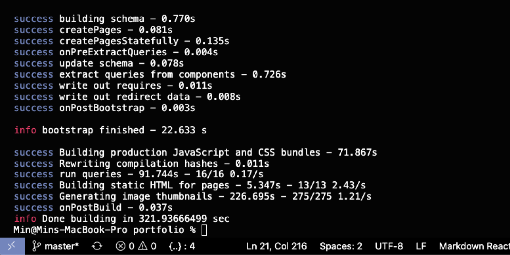

Gatsby is a modern static site generator based on *React*. It is a popular choice for building a <a href='https://jamstack.wtf/' target='_blank' rel='noopener noreferrer'>**JAMstack**</a> site in combination with a headless Content Management System (CMS) such as *Strapi*, *Ghost*, *Contentful*, etc. 

I decided to develop my personal portfolio with *Gatsby.js* and *Strapi* because of the performance and popularity. In addition, it should be relatively easy to capture for me since I am quite familiar with writing *React*. At the end, the site was deployed on *Netlify*, which offers the hosting for web applications and supports the continuous deployment with github. Its full-stack is as bellow:

| Front-end | CMS    | SSG      | Data query | Deployment |
| :-------: | :----: | :------: | :--------: | :--------: |
| ReactJS   | Strapi | GatsbyJS | GraphQL    | Netlify    |
| Markdown  |        |          |            | Github     |

<TitleAnchored>Performance</TitleAnchored>

> Gatsby loads only critical parts of the page, so your site loads as fast as possible. Once loaded, Gatsby prefetches resources for other pages so that clicking on the site feels incredibly fast. -- Gatsby official

*Gatsby* is designed with the aim of performance. The static contents including markdown format are fetched and then translated into HTML, CSS and Javascript files fairly fast. Therefore, a user will not have bad refreshing and waiting experiences while browsing the website. In addition, there are diverse powerful plugins enhancing this advantage. 

For instance, the image plugins generate and source optimized-size images according to different breakpoints so that the long loadings of images can be avoided. These are the plugins I appreciate the most since I do not have to manually create an image in various sizes catering for screen sizes. On the other hand, Gatsby utilizes GraphQL query so that what and how much data is fetched are fully controlled by myself instead of limited by the predefined data structure or API. Bellow is one of GraphQL query I used in the project:

```js
export const query = graphql`
  {
    allMdx(
      filter: {
        fileAbsolutePath: { regex: "/projects/" }
        frontmatter: { featured: { eq: true } }
      }
      sort: { fields: frontmatter___sortDate, order: DESC } 
    ) {
      nodes {
        id
        slug
        frontmatter {
          title
          projectBrief
          projectStack
          url
          image {
            childImageSharp {
              fluid(maxWidth: 700) {
                ...GatsbyImageSharpFluid_withWebp
              }
            }
          }
        }
      }
    }
  }
`
```

<TitleAnchored>Build Time</TitleAnchored>

Having said that, the building experience is not as satisfying as the browsing one. My portfolio is relatively lightweight and simple and its production build costs about five minutes. According to desktop research, the building time will increase drastically when more and more contents and plugins are appended. If the site has to be changed and rebuilded constantly, the problem will inevitably become unbearable.

<div class='figure-container'>



</div>

<TitleAnchored>Lesson Learned</TitleAnchored>

A simple presentation site such as this one can absolutely benefit from Gatsby. There are many unmentioned advantages such as a clear and well-structured official documentation, diverse choices of templates, 2000+ plugins, large and growing community. However, if the architectures and integrations of the site are complex and tricky, it would be better to go for other options.