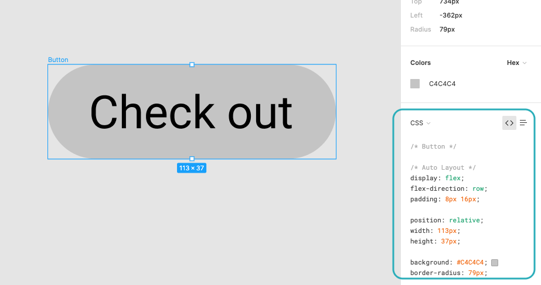
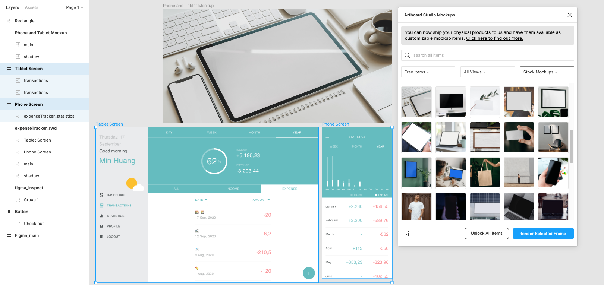
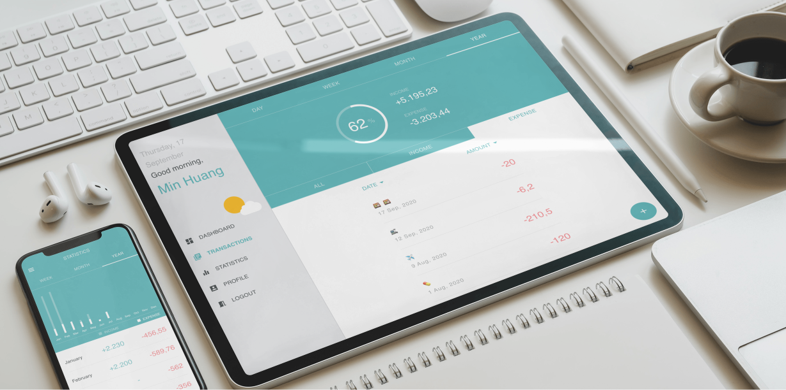

import autoLayout from './figma_autoLayout.gif';

Figma is a web-based vector graphics editor and prototyping tool first released in 2016. Before I get to know Figme, I mainly use Sketch for user interface (UI) and user experience (UX) design. However, Figma has now become my favorite tool. Here are some impressive features I would like to highlight:

<TitleAnchored>Auto Layout</TitleAnchored>

Keyboard shortcuts: *Shift + A* <--> *Alt + Shift + A*

Resizing is a nightmare for all designers. For instance, when the text or content changes, a button or a card has to be resized accordingly, even if the padding remains the same. Unfortunately, that is a scenario constantly happening during the design process, which wastes a lot of unnecessary time. 

That is exactly where *Auto Layout* comes into play. Auto Layout can be applied to any pair of content and container. By doing so, when the content is changed, the container will resize automatically to maintain the defined vertically and horizontal padding. Besides, the padding can be easily modified in the properties panel. This is especially useful when there is a last minute change of the content from clients. 

  <figure>
    
    <figcaption>A simple demo of the usage of Auto Layout</figcaption>
  </figure>

Find out more about how to use *Auto Layout* from <a href='https://help.figma.com/hc/en-us/articles/360040451373' target='_blank' rel='noopener noreferrer'>**Figma tutorial**</a>, and more advanced usages of Auto Layout from <a href='https://www.figma.com/blog/announcing-auto-layout/#how-auto-layout-works' target='_blank' rel='noopener noreferrer'>**Figma blog**</a>.

<TitleAnchored>Code Inspection</TitleAnchored>

As an individual who both designs and develops UI, I really appreciate the feature of code inspection, which automatically generates CSS code based on the design. It makes the transition of design to development a lot smoother and optimized the workflow. Once the design is completed, I can directly copy the auto-generated code from the properties panel on the right and that saves me a lot of time from styling the components line by line.

<TitleAnchored>Plugins</TitleAnchored>

Since Figma is a relatively new design tool compared to Sketch, Figma does not have as many third-party plugins as Sketch. However, there is one I found quite useful while creating a contextual rendering of a digital design, <a href='https://artboard.studio/' target='_blank' rel='noopener noreferrer'>**Artboard Studio Mockups**</a>.

Normally, making a contextual rendering requires high-resolution images of the ideal scenario and the screen design and, most importantly, time-consuming photoshop works. However, it becomes much easier with the help of this powerful plugin offering diverse free mockups and templates. 

First, choose a preferred mockup from the selection. Second, paste the screen design in the provided blank frame. Last, press *Render Selected Frame* and then the image synthesis is done in minutes.

There are still many fascinating and mind-blowing features unmentioned in this article. For instance, Figma provides prototyping functionality apart from design and code inspection. Moreover, Figma allows designers to remotely co-create in real time because it is a cloud-based platform, which completely reshapes the design process and workflow. Explore more on <a href='https://www.figma.com/' target='_blank' rel='noopener noreferrer'>**Figma website**</a>.