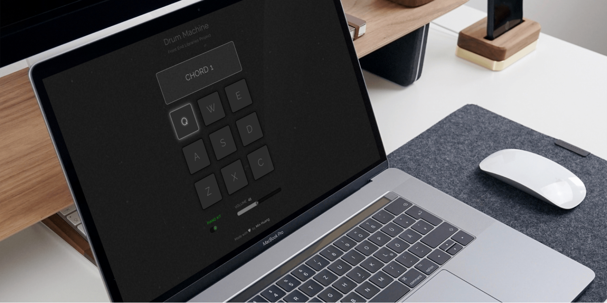

This project is part of the front-end libraries certification from *freeCodeCamp*. This is my first time utilizing HTML audio tag in a web application. Therefore, there are a few lessons learned worth mentioning and noting down.

<TitleAnchored>Rewind Audio</TitleAnchored>

When an application contains multiple audio files, it is important to keep in mind that the audio has to be properly rewound every time before playing. Otherwise the audio will resume from its previous end point if the last play is not fully complete. The following script will reset the start point and rewind the audio:

```
const audio = document.getElementById('myAudio');
audio.currentTime = 0;
```

<TitleAnchored>Prevent Keyboard Long-press</TitleAnchored>

The project is responsive and supports cross platform. Therefore, the drum pads have to bind with touch, mouse and keyboard events. However, when a key is long pressed, the audio is in turn triggered and played repeatedly, which causes an extremely annoying experience for a user.The keyboard event API offers an intuitive and easy solution:

```
cont handleKeyDown = (event) => {
	If (event.repeat) return;
	playAudio();
};
```
See the <a href="https://minhuang-drum-machine.netlify.app/" target="_blank" rel="noopener noreferrer">**LIVE DEMO**</a> and the <a href="https://github.com/MinHuang-TW/react-drum-machine" target="_blank" rel="noopener noreferrer">**SOURCE CODE**</a> of the react drum machine

<div class='figure-container'>



</div>