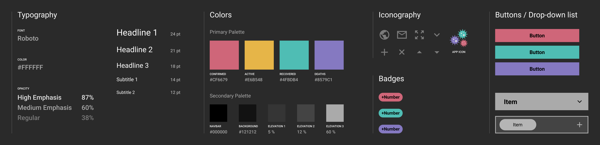

---

<TitleAnchored>Summery</TitleAnchored>

  <a
    href="https://en.wikipedia.org/wiki/COVID-19_pandemic"
    target="_blank"
    rel="noopener noreferrer"
  >
    <strong style={{ marginRight: 10 }}>Coronavirus disease(COVID-19)</strong>
  </a>
  is an ongoing global pandemic resulting in more than 28 million cases and 900K
  deaths. As of now, countless people’s lives have been changed because of the loss
  of jobs or family and it becomes one of the most concerning topics. Many digital
  tools are in turn created to enable people to keep track of the latest situation.

However, these tools often display too much information to users requiring specific data. Besides, the interface is also too complex for them. Therefore, this project aims to simplify data and the interface as much as possible so that those users are able to perform the daily query with ease.

---

<TitleAnchored>User Story</TitleAnchored>

The COVID-19 Tracker consists of two sections:

- Overview of the Selected Country: A user can not only get to know the amount of today's confirmed, recovered, deaths cases but also the current amount and ratio of recovered and deaths cases to confirmed cases of the selected country.

- Comparison of Selected Countries: A user can select up to five countries and compare their case-growing trend and further details. Moreover, the information of each country can be turned on or off and all countries can be sorted in ascending or descending order according to different user needs.

<TitleAnchored>Interface Design</TitleAnchored>

The wireframe was further crafted by implementing the design system. The main design goal is to differentiate complex data with a clear visual hierarchy. For instance, the chromatic color theme classified data into confirmed, active, recovered and deaths cases.

<TitleAnchored>Web Development</TitleAnchored>

The COVID-19 Tracker is a _single-page application(SPA)_ and _progressive web application(PWA)_ developed in _HTML_, _CSS_, _React.js_ and _Service Worker_ and deployed on _Netlify_.

<ul class='paragraph'>

- Data Visualization

The data is powered by <a href='https://disease.sh/docs/' target='_blank' rel='noopener noreferrer'>**NOVELCovid API**</a> sourced from _Worldometer_, _Johns Hopkins University_, etc. and visualized with _Mapbox GL JS_ and _Chart.js_ in various ways such as map, histogram, pie chart, etc. In addition, _Chart.js_ and _CountUp.js_ were implemented to animate the transition of charts and numbers respectively.

- Selecting & Tracking Countries

Apart from the drop-down menu, the confirmed-case map offers an alternative way to select a country for users. In the comparison section, the selected countries are saved in the _localStorage_ to reduce the repetitive selection of tracking countries next time.

</ul>

