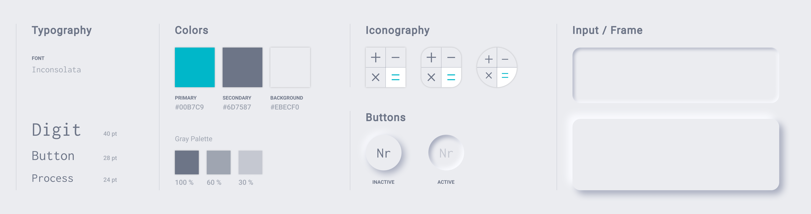
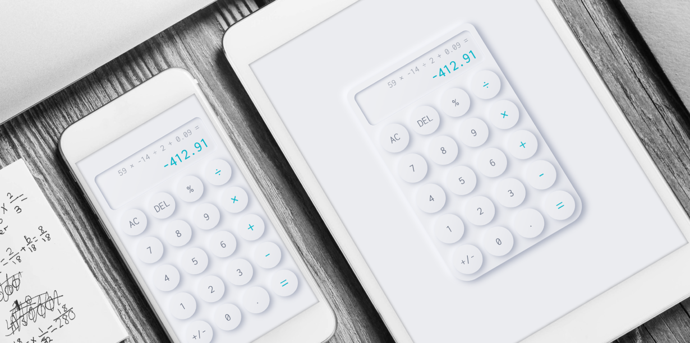

---

<TitleAnchored top={0}>Summery</TitleAnchored>

The majority of existing digital calculators do not display the calculation process. When a user performs a long calculation, it brings a lot of troubles since it is easy to forget or mistype a digit. Thus, the user has no choice but to start over. The project built by _javascript_ aims to solve this problem by displaying both the process of calculating and the end result.

The project, which is deployed on _Netlify_, is a _progressive web application_(PWA) so offline mode is supported. Beside, this project utilizes immediate execution logic and fixes the js numeric precision issue by applying a third-party library, _Decimal light.js_.

<h4>
  Live Demo <BsArrowRight />
</h4>

<iframe
  class="calculator"
  name="js calculator"
  src="https://rekenmachine.netlify.app/"
/>

---

<TitleAnchored>Design Goal</TitleAnchored>

- Display each calculation step until the calculation is done
- Clear visual hierarchy between calculating digits and the end result
- Smooth pressing interaction with salient user feedback
- _Responsive web design_(RWD) across mobile devices(e.g. mobile phone, tablet)

<TitleAnchored>User Interface Design</TitleAnchored>

The user interface of the calculator was designed based on the core of _Neumorphism_, which became a popular visual design trend that blends techniques from skeuomorphism, realism, and flat design in late 2019. One of the advantages of neumorphic button is the salient user feedback while the button is active or inactive.

<TitleAnchored>Web Development</TitleAnchored>

The project was developed in _javascript_ while the animation was created with _CSS_. Besides, _Service Workers_ was utilized to turn this project into a _progressive web application_(PWA) and make it work offline. At the end, the project was deployed on _Netlify_.

In javascript, there are numeric precision issues, which would be problematic for a calculation project. Therefore, _Decimal light.js_ is used to not only fix the problem but also perform the operation instead of _eval()_, which is a dangerous function and exposes users to high security risks according to <a href="https://developer.mozilla.org/en-US/docs/Web/JavaScript/Reference/Global_Objects/eval#:~:text=eval()%20is%20a%20dangerous,permissions%20of%20your%20webpage%20%2F%20extension" target="_blank" rel="noopener noreferrer">**MDN**</a>.

<TitleAnchored>Future Development</TitleAnchored>

Currently, the calculator offers only the basic arithmetic. It is possible to upgrade the existing calculator to a scientific one by adding more advanced arithmetic like the factorial function, trigonometric functions and so on.
