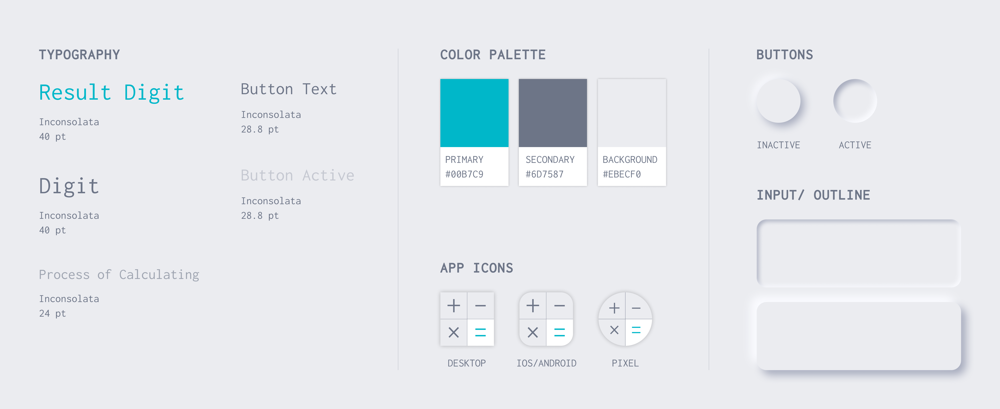

---

<TitleAnchored top={0}>Summery</TitleAnchored>

The majority of existing digital calculators do not display the calculation process. When a user performs a long calculation, it brings a lot of troubles since it is easy to forget or mistype a digit. Thus, the user has no choice but to start over.

The project built by vanilla javascript aims to solve this problem by displaying both the process of calculating and the end result. The calculation utilizes _immediate execution logic_ and a third-party library, _Decimal js_, is used to fix javascript numeric precision issues. Besides, this project is a _progressive web application_(PWA) so offline mode is supported.

<h4>
  Live Demo <BsArrowRight />
</h4>

<iframe
  class="calculator"
  name="js calculator"
  src="https://rekenmachine.netlify.app/"
/>

---

<TitleAnchored>Design Goal</TitleAnchored>

- Display each calculation step until the calculation is done
- Clear visual hierarchy between calculating digits and the end result
- Smooth pressing interaction with salient user feedback
- _Responsive web design_(RWD) across mobile devices(e.g. mobile phone, tablet)

<TitleAnchored>User Interface Design</TitleAnchored>

The user interface of the calculator was designed based on the core of _Neumorphism_, which became a popular visual design trend that blends techniques from skeuomorphism, realism, and flat design in late 2019. One of the advantages of neumorphic button is the salient user feedback while the button is active or inactive.

