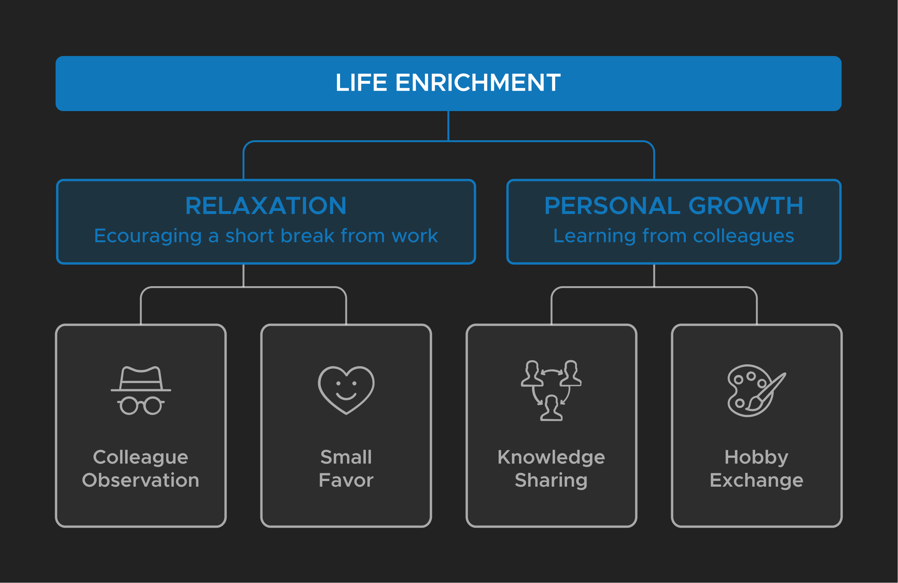
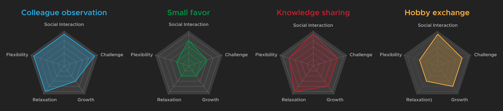
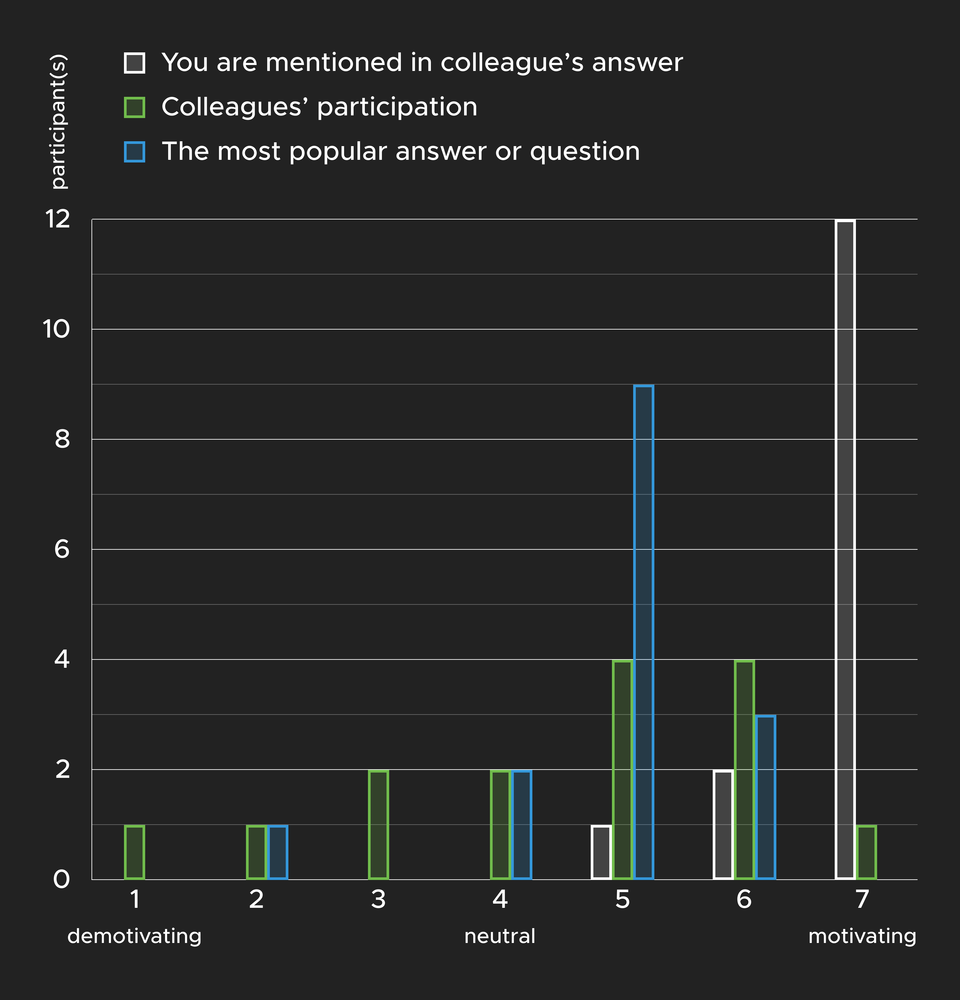

<TitleAnchored top="2.5rem">Background</TitleAnchored>

This graduation project was conducted with the cooperation of _OfficeVitae_. The shared goal was to propose design solutions in pursuit of sustainable millennial employees' vitality promotion at work.

---

<TitleAnchored top='0'>Summery</TitleAnchored>

> How can millennial employees’ vitality be sustainably promoted in the context of work through a designed product?

Millennial employees’ vitality at work is significantly affected by the harmony in the fulfillment of work and life achievement. The project explored possibilities of enriching life through drawing new inspirations from colleagues to achieve work-life harmony.

_SpInsight_(see LIVE DEMO) is a platform encouraging millennial employees to explore non-work-related aspects of colleagues with the aim of taking a short mental switch from work. It potentially triggers more face-to-face non-work-related interaction with colleagues, which enhances vitality at work.

<h4>
  Live Demo 
  (Press Login/ Sign up an account) 
  <BsArrowRight />
</h4>

<iframe src='https://spinsight.netlify.app/login' />

---

<TitleAnchored>Approach</TitleAnchored>

The project started with the <a href='#Research Findings'>**USER-CENTRIC RESEARCH**</a> with millennial employees into effective vitality strategies at work. Then, the person-product interaction facilitating the long-term vitality goal was explored by means of iterative <a href='#Insights From Research Through Design'>**RESEARCH THROUGH DESIGN**</a>. At the end, a digital social <a href='#Conceptualization'>**VITALITY PLATFORM**</a> was created in pursuit of sustainable employee vitality promotion at work, and <a href='#Final Evaluation'>**EVALUATED**</a> in the actual context.

<TitleAnchored>Research Findings</TitleAnchored>

> What is the millennial employees’ vitality goal at work?

Through literature and user-centric research(contextmapping), vitality themes and factors were formulated. Millennial employees’ vitality at work is significantly affected by the interpersonal(e.g. social interaction) and organizational factors(e.g. work-life balance). They seek harmony in the fulfillment of work and life achievement, which was identified as the ultimate goal in terms of the long-term influence and salient impact on millennial employees.

  The research phase was concluded with the selected vitality direction _Life
  Enrichment through drawing new inspirations from colleagues_ on account of
  social interaction and active participation, which are successful long-term
  implementing criteria identified from digital health and existing workplace
  products.

<TitleAnchored>Insights From Research Through Design</TitleAnchored>

> How can millennial employees’ vitality goal be sustainably promoted at work through a designed product or a service?

Four generated concepts were tested in a startup company and the results were assessed by the vitality criteria, active participation and simplicity. The curiosity about the non-work-related aspect of colleagues was discovered as a strong intrinsic motivator. Therefore, the concept of encouraging millennial employees to take short mental breaks via answering a non-work-related random question about colleagues and triggering interactions between them(e.g. find out the answer) was selected.

> How can the Vitality Platform support person-product interaction to achieve the vitality goal in the long run?

Optimized person-product interaction of the selected concept was explored through testing digital prototypes(see LIVE DEMO) with 11 millennial employees. Based on the result, the Spin Wheel(3) was chosen for:

- Optimized interaction: Inviting, evoking positive emotions

- Better leveraging motivators: Different difficulty levels of questions

In addition, other colleague's answers are appealing and motivating, which should be included in the further development.

<h4>
  Live Demo <BsArrowRight />
</h4>

1. Plain
1. Printout
1. Spin Wheel
1. Slot Machine
1. Scratch Card

<iframe src='https://spinsight-prototype.netlify.app/' />

<TitleAnchored>Conceptualization</TitleAnchored>

> How can millennial employees’ vitality goal be sustainably promoted at work through the Vitality Platform?

- Design Goal: A digital platform encouraging millennial employees to explore non-work-related aspects of colleagues with the aim of taking a mental switch from work

- Target Interaction: Engaging, Curious and Relaxed

The final concept, _SpInsight_, has three main functions: requesting, answering and proposing a random question about colleagues with various difficulty levels: appearance, belongings, character, experience and customized questions.

<TitleAnchored>Prototype Development</TitleAnchored>

The final concept was prototyped with modern web technologies. The front-end was created with _HTML5_, _CSS3_, _React.js_ and _Redux_ while the back-end was built with _Firebase cloud functions_, _Express_, _Node.js_. The user authorization was verified with _Firebase auth_. At the end, the front-end and back-end were deployed on _Netlify_ and _Firebase cloud_ respectively.

<TitleAnchored>Final Evaluation</TitleAnchored>

The <a href="#Summery">**PROTOTYPE**</a> was then evaluated with 37 participants in
four companies for a week. It worked well in the group of 12 interns and triggered more face-to-face non-work-related interaction between them, which in turn enhances vitality. However, the rest of participants showed less motivation because of less motivating questions and lack of triggers.

Thus, two focus groups were conducted to clarify the critical long-term motivators. The curiosity about how colleagues perceive oneself was the most powerful motivator to enhance the retention (e.g. push notification like _You are mentioned in an answer._).

<TitleAnchored>Future Development</TitleAnchored>

In general, SpInsight is suitable in a workplace and considered fun and engaging. However, how to precisely attract group participation and sustain millennial employees’ interest and motivations over time in different working contexts(e.g. company scale, department, company culture, the stage of group development) requires further research and evaluation.
